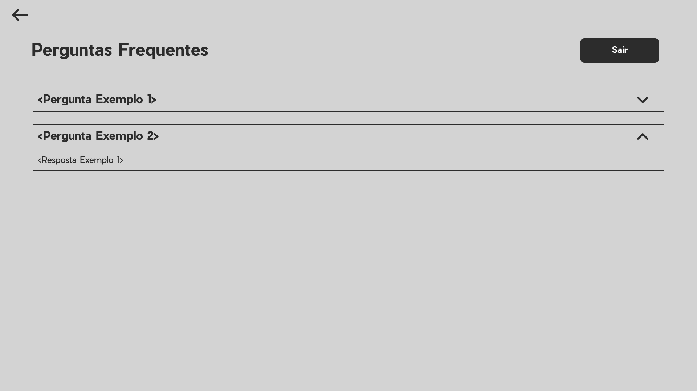
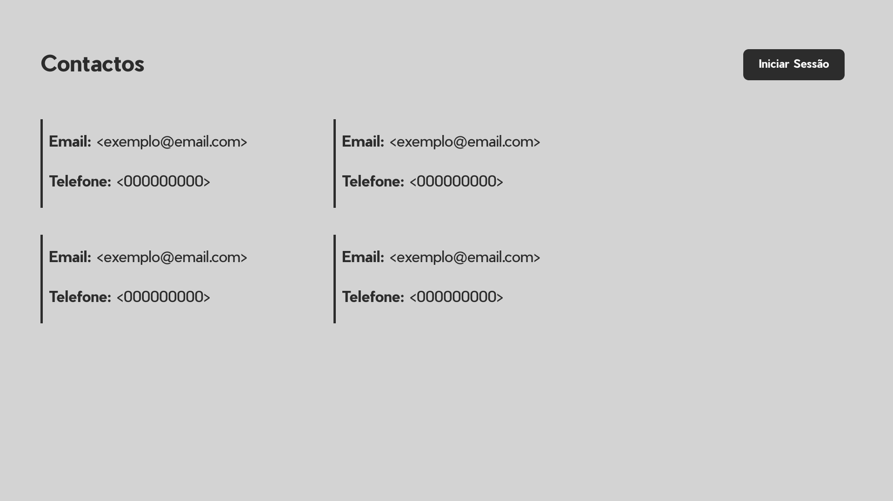
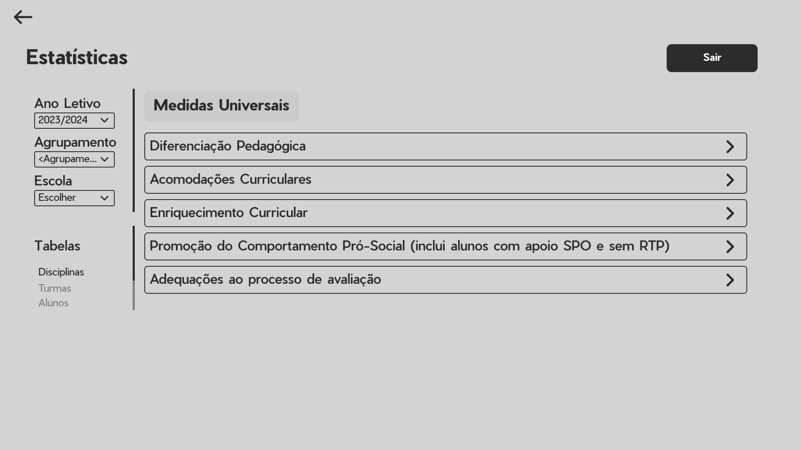
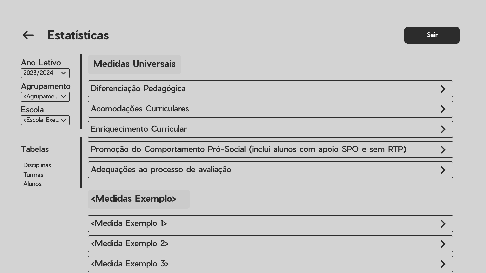
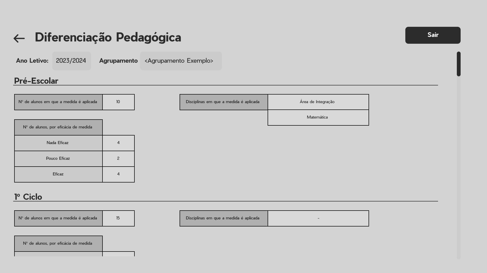
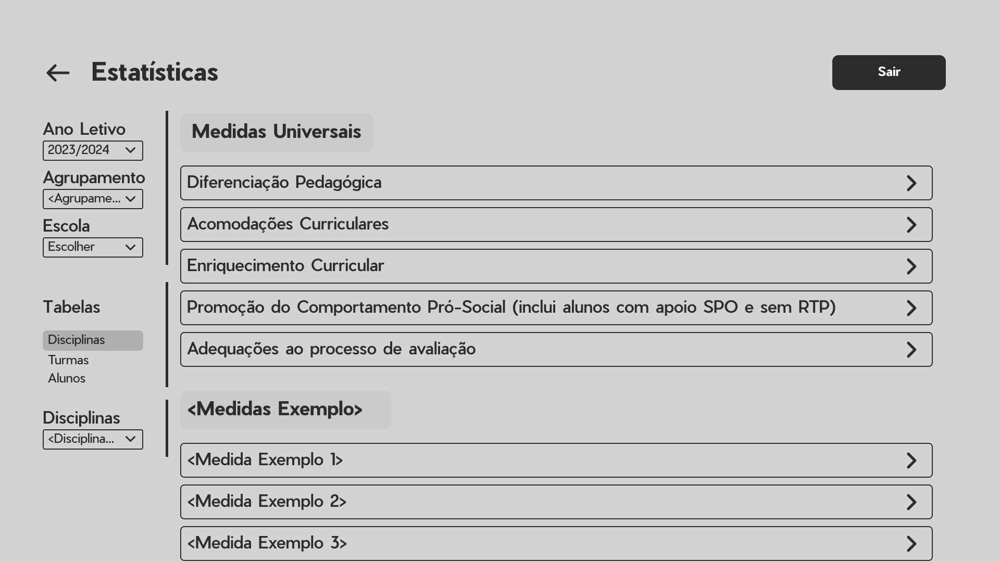
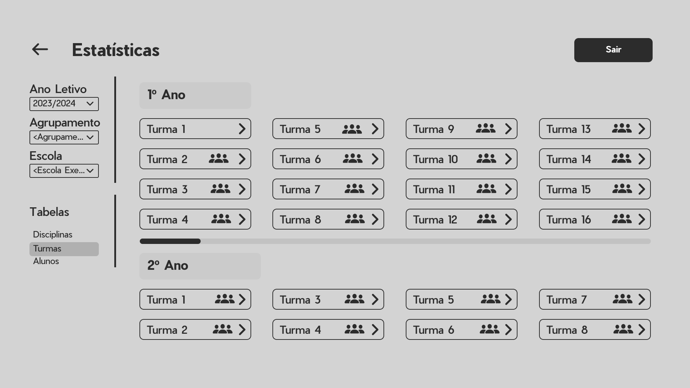
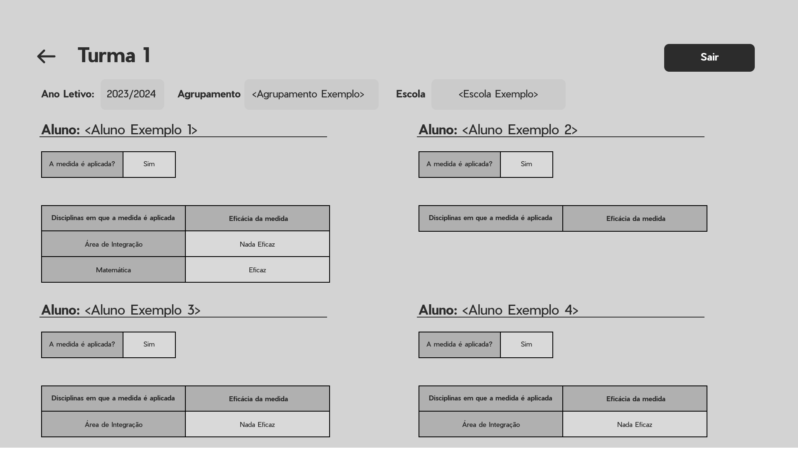
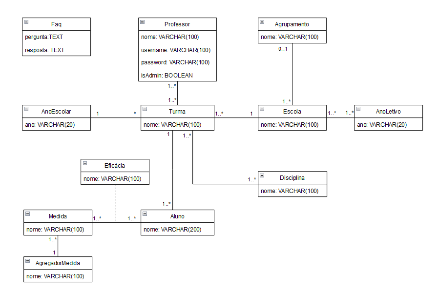
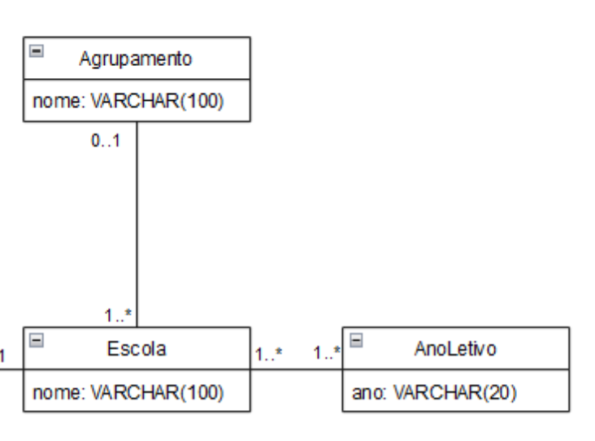

# Aplicação Web - EMAE

Olá equipa da EMAE! Este é o documento que apresenta uma primeira visão sobre o que será a melhor aplicação web para recolher os dados relativos às medidas.

 

## Intervenientes
No contexto desta web app, existem 2 tipos de utilizadores:

- **Professores**: estes utilizadores apenas preenchem os campos das medidas das turmas que lecionam. Para além desta interação, podem autenticar-se na aplicação e ver avisos acerca de dados que lhe faltam preencher. 

- **Administradores**: membros da equipa de trabalho, que têm controlo total sobre a aplicação. Criam as turmas, com os alunos e disciplinas associadas. Podem também ver os dados preenchidos pelos professores e aceder a várias estatísticas sobre os dados recolhidos.

 

## User Stories

User stories são descrições simples de uma funcionalidade espectável da aplicação, contada do ponto de vista de um utilizador da aplicação. 

### Professores
- **US01**: Como professor, quero autenticar-me na aplicação.
- **US02**: Como professor, quero preencher os campos das medidas das turmas que leciono com os dados que recolhi.
- **US03**: Como professor, que poder editar os dados que inseri previamente.
- **US04**: Como professor, quero ser informado dos meus alunos que ainda não têm as medidas preenchidas.
- **US05**: Como professor, quero ter uma página de ajuda para saber como utilizar a aplicação.

 

### Administradores

- **US11**: Como administrador, quero autenticar-me na aplicação.
- **US12**: Como administrador, quero criar turmas.
- **US13**: Como administrador, quero especificar detalhes de cada turma, como o agrupamento a que pertencem.
- **US14**: Como administrador, quero associar alunos às turmas.
- **US15**: Como administrador, quero associar disciplinas às turmas.
- **US16**: Como administrador, quero conseguir agrupar os dados por ano letivo.
- **US17**: Como administrador, quero criar, modificar e eliminar contas para os professores.
- **US18**: Como administrador, quero modificar os dados de turmas, alunos e disciplinas.
- **US19**: Como administrador, quero definir os valores que os professores podem atribuir à eficácia das medida.
- **US20**: Como administrador, quero ter acesso às estatísticas das disciplinas.
- **US21**: Como administrador, quero ter acesso às estatísticas dos alunos.
- **US22**: Como administrador, quero ter acesso às estatísticas das medidas.
- **US23**: Como administrador, quero ter acesso às estatísticas das escolas.
- **US24**: Como administrador, quero ter acesso às estatísticas dos agrupamentos.
- **US25**: Como administrador, quero ter acesso às estatísticas dos anos escolar.
- **US26**: Como administrador, quero experimentar a visão do professor para verificar se os dados estão corretos.
- **US27**: Como administrador, quero preencher os dados dos meus alunos.

 

## Mockups

Os mockups são representações visuais de como será a aplicação. Estes são apenas uma primeira versão e, muito provavelmente, sofrerão alterações ao longo do desenvolvimento, considerando o vosso feedback.

Figura 1 - Página de autenticação

---

Figura 2 - Página de FAQs

---

Figura 3 - Página de contactos

---

Figura 4 - Página inicial de um professor

---

Figura 5 - Página inicial de um professor

---

Figura 6 - Página inicial de um professor

---

Figura 7 - Página inicial de um professor

---

Figura 8 - Página inicial de um administrador

---

Figura 9 - Página de gestão de agrupamentos

---

Figura 10 - Página de gestão de agrupamentos

---

Figura 11 - Página de gestão de agrupamentos

---

Figura 12 - Página de gestão de agrupamentos

---

Figura 13 - Página de gestão de turmas

---

Figura 14 - Página de gestão de turmas

---

Figura 15 - Página de gestão de turmas

---

 

Figura 16 - Página de estatísticas

---

Figura 17 - Página de estatísticas com escola aplicada

---

Figura 18 - Página de estatísticas de uma medida

---

Figura 19 - Página de estatísticas com disciplina selecionada

---

Figura 20 - Página de estatísticas com turma selecionada

---

Figura 21 - Página de estatísticas de uma turma

---

Figura 22 - Página de estatísticas dos alunos de uma turma

---

 

## Base de Dados

Esta será a estrutura da base de dados. Embora seja algo mais técnico, dá para dar-vos uma ideia dos objetos que farão parte da aplicação, bem como das relações entre eles. 

Um traço entre duas caixas significa que existe uma relação entre os objetos que representam e os números em cada extremidade do traço indicam o número de objetos de cada tipo que podem estar relacionados.

Figura 23 - Esquema da base de dados

Como ler um relação entre caixas:

Neste exemplo, existe uma relação entre Escola e AnoLetivo. Uma escolha pode pertencer a um ou vários anos letivos (1..\*), e um ano letivo pode conter uma ou várias escolas (1..\*).

Para além disso, a Escola também está relacionada com o Agrupamento. Neste caso, uma escola pertence a zero ou a um agrupamento (0..1), mas um agrupamento pode conter uma ou várias escolas (1..\*).
